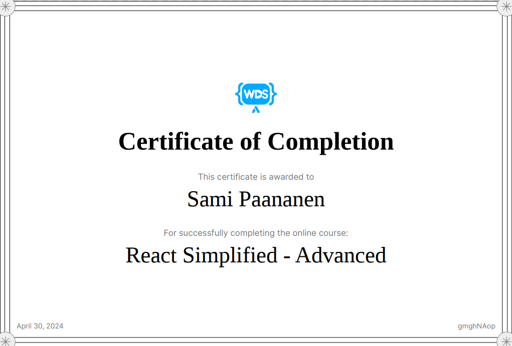

<h1 align="center"> Sami Paananen </h1>
<h3>Frontend developer with a secret passion for backend development and a keen interest in cloud-driven solutions, currently pursuing a second year Information and Communication Technology Engineering degree at Metropolia UAS equipped with a strong problem-solving mindset to conquer any challenge</h3>

## About me

  - <strong>Location:</strong> Finland  
  - <strong>Languages:</strong> Fluent in Finnish and English  
  - <strong>Currently studying:</strong> NextJS, Docker, and AWS  
  - <strong>Education:</strong> Second-year Information and Communication Technology Engineering student at Metropolia UAS, specializing in software development  
  - <strong>Interests:</strong> Frontend and backend development, cloud computing, problem-solving  
  - <strong>Passions:</strong> Exploring innovative technologies, building scalable solutions, contributing to open-source projects  
  - <strong>Skills:</strong> Proficient in HTML, CSS, JavaScript, React, Node.js, Git, familiarity with databases (e.g., MongoDB, MySQL), experience with agile methodologies  
  - <strong>Projects:</strong> Currently working on a music recommendation system inspired by spotify. Working on the backend with python and the frontend with React. [Repo](https://github.com/Sami-Juhani/music-recommendation-system)
  - <strong>Goals:</strong> Striving to become a versatile fullstack software engineer capable of tackling complex challenges and making a meaningful impact in the tech industry  

## Projects

<table>
  <tr>
    <td>
      <h4>E-commerce site</h4>
       
      A fullstack e-commerce site made with MERN-stack 
      <a href="https://github.com/Sami-Juhani/Ecommerce-site">Repo</a>
    </td>
    <td>
      <h4>Another Cat Game</h4>
       
      A fun little game made with vanilla JS 
      <a href="https://github.com/Sami-Juhani/Another-Cat-Game">Repo</a>
    </td>
    <td>
      <h4>3-Phase Airport Simulator</h4>
       
      A 3-phase airport simulation program made with Java 
      <a href="https://github.com/Sami-Juhani/AP-Simulation-Java">Repo</a>
    </td>
  </tr>
</table>

<h3 align="center">For more information about my projects check my site <a href="https://samipaan.com/portfolio">HERE</a></h4>

## Languages & Tools

&nbsp;&nbsp;&nbsp;&nbsp;&nbsp;&nbsp;&nbsp;&nbsp;&nbsp;&nbsp;&nbsp;&nbsp;&nbsp;&nbsp;&nbsp;&nbsp;&nbsp;&nbsp;&nbsp;&nbsp;&nbsp;&nbsp;&nbsp;&nbsp;&nbsp;&nbsp;&nbsp;&nbsp;&nbsp;&nbsp;&nbsp;&nbsp;&nbsp;&nbsp;&nbsp;&nbsp;

## Certifications

[React Simplified - Beginner](https://courses.webdevsimplified.com/react-simplified-beginner) &nbsp;&nbsp;&nbsp;&nbsp;&nbsp;&nbsp;&nbsp;&nbsp;&nbsp;&nbsp;&nbsp;&nbsp;&nbsp;&nbsp;&nbsp;&nbsp;&nbsp;&nbsp;&nbsp;&nbsp;&nbsp;&nbsp;&nbsp;&nbsp;&nbsp;&nbsp;&nbsp;&nbsp;&nbsp;&nbsp;&nbsp;&nbsp;&nbsp;&nbsp;&nbsp;&nbsp;&nbsp;&nbsp;&nbsp;&nbsp;&nbsp;&nbsp;&nbsp;&nbsp;&nbsp;&nbsp;&nbsp;&nbsp;&nbsp;&nbsp;&nbsp;&nbsp; [React Simplified - Advanced](https://courses.webdevsimplified.com/react-simplified-advanced)

 &nbsp;&nbsp;&nbsp; 

[View certificate](./assets/certs/React%20Simplified%20-%20Beginner-certificate.pdf) &nbsp;&nbsp;&nbsp;&nbsp;&nbsp;&nbsp;&nbsp;&nbsp;&nbsp;&nbsp;&nbsp;&nbsp;&nbsp;&nbsp;&nbsp;&nbsp;&nbsp;&nbsp;&nbsp;&nbsp;&nbsp;&nbsp;&nbsp;&nbsp;&nbsp;&nbsp;&nbsp;&nbsp;&nbsp;&nbsp;&nbsp;&nbsp;&nbsp;&nbsp;&nbsp;&nbsp;&nbsp;&nbsp;&nbsp;&nbsp;&nbsp;&nbsp;&nbsp;&nbsp;&nbsp;&nbsp;&nbsp;&nbsp;&nbsp;&nbsp;&nbsp;&nbsp;&nbsp;&nbsp;&nbsp;&nbsp;&nbsp;&nbsp;&nbsp;&nbsp;&nbsp;&nbsp;&nbsp;&nbsp;&nbsp;&nbsp;&nbsp;&nbsp;&nbsp;&nbsp;&nbsp; [View certificate](./assets/certs/React%20Simplified%20-%20Advanced-certificate.pdf)

## Contact

&nbsp; | &nbsp;
<a href="mailto:sami.paananen@gmail.com">&nbsp;sami.paananen@gmail.com</a>