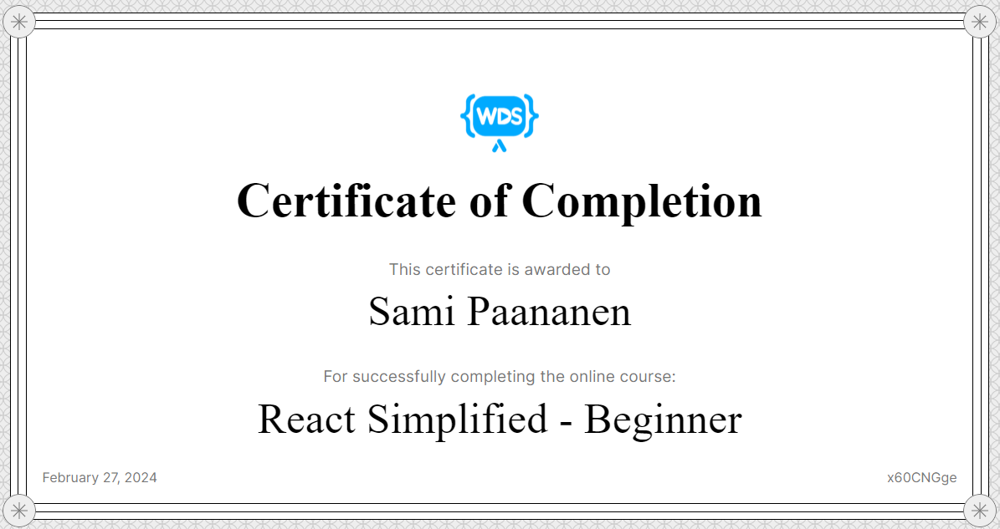

<h1 align="center"> Sami Paananen </h1>
<h3> Frontend developer with secret passion for backend developement and a keen interest in cloud driven solutions. Second year Information and communication technology engineering student at Metropolia UAS.</h3>

## About me

- Location: Finland
- Languages: Finnish, English
- Currently studying:
  - NextJS and AWS

## Projects

<table>
  <tr>
    <td>
      <h4>E-commerce site</h4>
       
      A fullstack e-commerce site made with MERN-stack 
      <a href="https://github.com/Sami-Juhani/Ecommerce-site">Repo</a>
    </td>
    <td>
      <h4>Another Cat Game</h4>
       
      A fun little game made with vanilla JS 
      <a href="https://github.com/Sami-Juhani/Another-Cat-Game">Repo</a>
    </td>
    <td>
      <h4>3-Phase Airport Simulator</h4>
       
      A 3-phase airport simulation program made with Java 
      <a href="https://github.com/Sami-Juhani/AP-Simulation-Java">Repo</a>
    </td>
  </tr>
</table>

#### For more information about my projects check my site [HERE]("https://samipaan.com/portfolio")

## Languages & Tools

&nbsp;&nbsp;&nbsp;&nbsp;&nbsp;&nbsp;&nbsp;&nbsp;&nbsp;&nbsp;&nbsp;&nbsp;&nbsp;&nbsp;&nbsp;&nbsp;&nbsp;&nbsp;&nbsp;&nbsp;&nbsp;&nbsp;&nbsp;&nbsp;&nbsp;&nbsp;&nbsp;&nbsp;&nbsp;&nbsp;&nbsp;&nbsp;&nbsp;&nbsp;&nbsp;&nbsp;

## Certifications

[React Simplified - Beginner](https://courses.webdevsimplified.com/react-simplified-beginner)

## Contact

&nbsp; | &nbsp;
<a href="mailto:sami.paananen@gmail.com">&nbsp;sami.paananen@gmail.com</a>